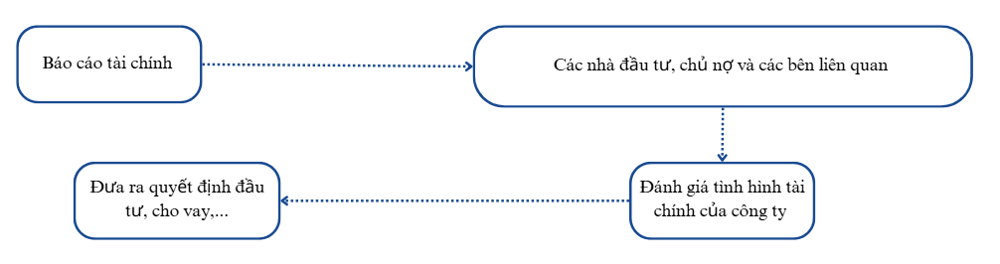

# CHƯƠNG 1: GIỚI THIỆU VỀ BÁO CÁO TÀI CHÍNH

1.1

**Vai trò của báo cáo tài chính**

Báo cáo tài chính đề cập đến cách thức các công ty thể hiện hiệu quả tài chính của mình đối với các nhà đầu tư, chủ nợ và các bên liên quan khác thông qua việc chuẩn bị và trình bày các báo cáo tài chính.

---

1.1

**Vai trò của phân tích báo cáo tài chính**

Phân tích báo cáo tài chính là việc sử dụng thông tin từ các báo cáo tài chính của công ty, cùng với các thông tin liên quan khác, để đưa ra quyết định kinh tế. Các nhà phân tích sử dụng dữ liệu báo cáo tài chính để đánh giá hiệu quả hoạt động trong quá khứ và tình hình tài chính hiện tại của công ty, từ đó hình thành ý kiến về khả năng của công ty trong việc kiếm lời và tạo ra dòng tiền trong tương lai.

---

1.2

**Các Loại Báo Cáo Trong Báo Cáo Tài Chính** 

---

1.2

**Bảng cân đối kế toán**

Báo cáo các loại tài sản chính và giá trị của chúng, nợ phải trả, và vốn chủ sở hữu cùng với mối quan hệ giữa chúng tại một thời điểm cụ thể

**Mối quan hệ** 

Tổng tài sản = Vốn chủ sở hữu + Tổng nợ phải trả

---

1.2

**Báo cáo thu nhập** 

Báo cáo về hiệu quả hoạt động của công ty (kết quả từ các hoạt động kinh doanh) dựa trên doanh thu, chi phí phát sinh, lãi và lỗ trong kỳ. Báo cáo giúp giải thích hiệu quả sinh lời (không phải dòng tiền) của công ty

**Mối quan hệ**

Lợi nhuận = Tổng doanh thu - Tổng chi phí

---

1.2

**Báo cáo luân chuyển tiền tệ**

Báo cáo về dòng tiền ra vào công ty trong một thời kỳ nhất định

**Bao gồm**

Dòng tiền từ hoạt động kinh doanh 

Dòng tiền từ hoạt động đầu tư

Dòng tiền từ hoạt động tài chính 

**Mối quan hệ** 

Dòng tiền thuần = Tổng dòng tiền vào - Tổng dòng tiền ra

---

1.2

**Báo cáo thay đổi vốn chủ sở hữu**

Báo cáo về sự thay đổi trong vốn chủ sở hữu (không phải báo cáo tài chính nào ở Việt Nam cũng có phần này)

**Nguyên nhân thay đổi vốn chủ sở hữu**

Lợi nhuận giữ lại

Vốn mới từ các nhà đầu tư

**Mối quan hệ** 

Vốn chủ sau khi thay đổi = Vốn chủ trước khi thay đổi + Sự thay đổi do Lợi Nhuận Giữ Lại hoặc Vốn Góp Mới  

---

1.3

**Tầm quan trọng của ghi chú báo cáo tài chính và thông tin bổ sung**

Ghi chú báo cáo tài chính và thông tin bổ sung đóng vai trò quan trọng trong việc cung cấp sự giải thích chi tiết về các con số trong báo cáo tài chính chính. Chúng giúp các nhà đầu tư, người cho vay và các bên liên quan khác hiểu rõ hơn về các giả định, phương pháp kế toán, và các yếu tố có thể ảnh hưởng đến tình hình tài chính của công ty. Những ghi chú này giúp:

*Giải thích các khoản mục trong báo cáo tài chính* 

*Cung cấp thông tin bổ sung về các yếu tố không thể hiện trong báo cáo tài chính*

*Hỗ trợ tính minh bạch và độ tin cậy*

*Giải thích các biến động quan trọng*

---

1.3 

**Tầm quan trọng của phần bình luận của ban quản lý**

*Phần bình luận của ban quản lý (yêu cầu theo U.S. GAAP) làm nổi bật những xu hướng và sự kiện quan trọng ảnh hưởng đến tính thanh khoản, nguồn vốn và hoạt động của công ty*

*Phần này cũng phải thảo luận về các chính sách kế toán quan trọng*

*Đây cũng là nơi ý kiến chủ quan của lãnh đạo doanh nghiệp được thể hiện liên quan đến các yếu tố vĩ mô và vi mô mà ảnh hưởng đến doanh nghiệp*

*Lưu ý: Phần bình luận này không có bất kỳ cơ chế xác minh nào xem có đúng sự thật hay không*

---

1.4

**Mục tiêu của kiểm toán độc lập đối với báo cáo tài chính** 

- Đảm bảo hợp lý rằng báo cáo tài chính tổng thể không có sai sót trọng yếu.
- Đưa ra ý kiến về các chuẩn mực kế toán, ước tính và giả định đã áp dụng.
- Đưa ra ý kiến về hệ thống kiểm soát nội bộ (chỉ yêu cầu theo GAAP).
- Báo cáo về các báo cáo tài chính và truyền đạt theo yêu cầu của các Tiêu chuẩn Kiểm toán Quốc tế (ISAs), dựa trên kết quả kiểm toán của kiểm toán viên.

---

1.4

**Các loại báo cáo kiểm toán**

Báo cáo kiểm toán không có ý kiến ngoại trừ (Unqualified audit report): *Báo cáo tài chính không có thiếu sót hay sai sót trọng yếu.*

Báo cáo kiểm toán có ý kiến ngoại trừ (Qualified audit report): *Có hạn chế về phạm vi hoặc có ngoại lệ đối với các chuẩn mực.*

Báo cáo kiểm toán bất lợi (Adverse audit report): *Báo cáo tài chính không tuân thủ chuẩn mực kế toán một cách trọng yếu.*

Báo cáo kiểm toán từ chối ý kiến (Disclaimer audit report): *Kiểm toán viên không thể đưa ra ý kiến kiểm toán.*

---

1.5

**Chuẩn mực kế toán lớn trong giới tài chính: IFRS và US GAAP**

**Bảng**: Một số sự khác biệt lớn giữa IFRS và US GAAP

| **Tiêu chí so sánh** | **US GAAP** | **IFRS** |
| --- | --- | --- |
| **Được phát triển bởi** | Hội đồng Chuẩn mực Kế toán Tài chính (FASB) | Hội đồng Chuẩn mực Kế toán Quốc tế (IASB) |
| **Dựa trên** | Quy tắc | Nguyên tắc |
| **Lãi suất trả** | Dòng tiền từ Hoạt động Kinh doanh | Dòng tiền từ Hoạt động Tài chính hoặc Hoạt động Kinh doanh |

---

1.5

**Bảng**: Một số sự khác biệt lớn giữa IFRS và US GAAP

| **Tiêu chí so sánh** | **US GAAP** | IFRS |
| --- | --- | --- |
| **Đánh giá hàng tồn kho** | Phương pháp Nhập trước, Xuất trước (FIFO); Nhập sau, Xuất trước (LIFO); và Phương pháp Trung bình Gia quyền | Phương pháp FIFO và Trung bình Gia quyền |
| **Chi phí phát triển** | Được coi là chi phí | Vốn hóa, chỉ nếu đáp ứng điều kiện nhất định |
| **Đảo ngược việc ghi giảm hàng tồn kho** | Cấm | Cho phép, nếu đáp ứng các điều kiện nhất định |

---

1.6 

**Các Nguồn Thông Tin Khác** 

- **Chỉ số kinh tế hoặc ngành** từ chính phủ và các tổ chức khác, như doanh số bán lẻ và chỉ số giá, thường được phát hành hàng tháng hoặc hàng quý.
- **Các phương tiện truyền thông chung và ngành**.
- **Mạng xã hội**, có thể là công cụ hữu ích để đo lường cảm nhận của khách hàng về sản phẩm của công ty.

---

1.6 

**Các Nguồn Thông Tin Khác** 

- **Nguồn thông tin từ bên thứ ba**:
    - Báo cáo và thông tin từ các nhà phân tích, bao gồm từ các chuyên gia bán hàng hoặc các cơ quan xếp hạng tín dụng.
    - Báo cáo và dữ liệu từ các nền tảng như Bloomberg, Wind, FactSet.
    - Báo cáo và dữ liệu từ các công ty tư vấn, thường là các nguồn ngành chuyên biệt như Rystad trong năng lượng, iQvia và Evaluate trong dược phẩm, và Gartner và IDC trong công nghệ thông tin.
- **Nghiên cứu sơ cấp tự thực hiện**:
    - Khảo sát, cuộc trò chuyện, so sánh sản phẩm và các nghiên cứu khác do nhà phân tích chỉ đạo hoặc thực hiện trực tiếp.