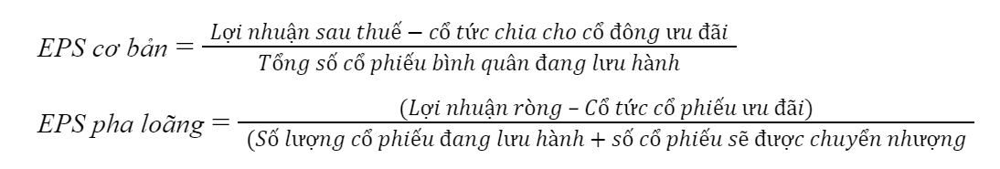

# CHƯƠNG 2: PHÂN TÍCH BÁO CÁO THU NHẬP (PHẦN 1)
---
**1.1 Giới thiệu** 

>Báo cáo thu nhập là một trong những loại báo cáo thu hút sự chú ý của thị trường nhất mỗi khi kỳ báo cáo tài chính đến. Trong đó, thành phần thường xuyên được để ý nhất là lợi nhuận sau thuế

Tuy nhiên, để hiểu rõ lợi nhuận sau thuế được tính toán như nào, việc nắm bắt được các nguyên tắc cơ bản về hạch toán báo cáo thu nhập là không thể thiếu 

---

**1.2 Hạch toán doanh thu** 

Nguyên tắc cơ sở dồn tích 

- **Công nhận doanh thu**: Doanh thu được công nhận khi **nó được kiếm** (earned), tức là khi rủi ro và quyền lợi của sở hữu hàng hóa hoặc dịch vụ đã được chuyển giao từ công ty sang khách hàng
    - Doanh thu thường được ghi nhận khi công ty **giao hàng hóa hoặc cung cấp dịch vụ** cho khách hàng

---

**1.2 Hạch toán doanh thu** 

Nguyên tắc cơ sở dồn tích 

- **Khi giao hàng trên cơ sở tín dụng**:
    - Nếu giao hàng được thực hiện **trên cơ sở tín dụng**, một tài sản liên quan (như **phải thu** hoặc **công nợ phải thu**) sẽ được ghi nhận
    - Sau đó, khi tiền mặt được nhận, các sổ sách tài chính chỉ đơn giản phản ánh việc thanh toán để giải quyết khoản phải thu

---
**1.2 Hạch toán doanh thu** 

Nguyên tắc cơ sở dồn tích 
- **Khi nhận tiền trước nhưng giao hàng sau**:
    - Trong trường hợp công ty **nhận tiền trước** (ví dụ thanh toán trước cho dịch vụ), nhưng **giao hàng hoặc cung cấp dịch vụ sau** (hoặc dần dần trong một khoảng thời gian), công ty sẽ ghi nhận một **nợ phải trả** (liability) cho doanh thu chưa thực hiện (unearned revenue) khi nhận tiền
    - **Doanh thu sẽ được công nhận dần dần** khi sản phẩm hoặc dịch vụ được giao

---

**1.3 Hạch toán chi phí** 

Nguyên tắc đối ứng

- **Matching** yêu cầu công ty **ghi nhận chi phí** (ví dụ: **giá vốn hàng bán - cost of goods sold**) cùng với **doanh thu** liên quan trong cùng một kỳ kế toán. Mục đích là để "đối ứng" chi phí với doanh thu được tạo ra từ các giao dịch hoặc sự kiện đó
- Trong thực tế, công ty có thể bán hàng từ **hàng tồn kho mua trong kỳ trước** hoặc **một phần hàng tồn kho trong kỳ hiện tại** sẽ được bán trong các kỳ sau. Vì vậy, **chi phí hàng bán** cần được ghi nhận trong cùng kỳ với doanh thu từ việc bán hàng đó

---

**1.4 Các khoản mục không thường xuyên** 

> Đây là những giao dịch, sự kiện hoặc khoản mục chỉ xảy ra một lần hoặc hiếm khi xảy ra, không phải là phần của hoạt động kinh doanh thường xuyên. Những khoản mục này có thể bao gồm **chi phí tái cấu trúc**, **lợi nhuận/lỗ từ việc bán tài sản**, hoặc **thiệt hại từ thiên tai**. 

>Các khoản mục không thường xuyên khi phân tích nên được tách biệt khỏi các khoản mục thường xuyên để người dùng báo cáo tài chính có thể đánh giá chính xác hơn hiệu quả hoạt động của công ty

**Ví dụ**: Một công ty sản xuất lớn tại Việt Nam thực hiện tái cấu trúc bộ phận sản xuất, bao gồm việc sa thải nhân viên và chi phí đóng cửa một nhà máy. Các khoản chi phí này là không thường xuyên vì chúng không phải là một phần của hoạt động hàng ngày

---

**1.5 Earnings Per Share**
>EPS cho biết khả năng sinh lời trên mỗi cổ phiếu. EPS có thể được dùng để theo dõi khả năng sinh lời của công ty theo thời gian hoặc dùng để so sánh giữa các công ty với nhau.

---
**1.5 Earnings Per Share**

**Phân loại**
- **EPS cơ bản**: Là lãi ròng chia cho số cổ phiếu trên sổ sách
- **EPS pha loãng**: Là lãi ròng chia cho số cổ phiếu trên sổ sách + số cổ phiếu tiềm năng từ các công cụ tài chính khác chuyển sang

**EPS cơ bản** giúp đánh giá khả năng sinh lời của công ty. Sau đó, **EPS pha loãng** cho thấy khả năng sinh lời đó có bị ảnh hưởng gì không khi tính đến các yếu tố như cổ phiếu tiềm năng hoặc chứng khoán có thể chuyển đổi

---

**1.5 Earnings Per Share**

**Công thức**

---
**1.6 Basic EPS**

Thông tin:

- **Lãi ròng**: 8 triệu đồng
- **Cổ tức ưu đãi**: 1 triệu đồng
- **Số lượng cổ phiếu phổ thông trung bình**: 5 triệu cổ phiếu

**Tính:** 

$$

Basic EPS = \frac{8,000,000 - 1,000,000}{5,000,000} = 1.4 
$$

Đơn vị: Triệu VND/ cổ phiếu

---

**1.6 Diluted EPS**

Thông tin:

- **Lãi ròng**: 8 triệu đồng
- **Cổ tức ưu đãi**: 1 triệu đồng
- **Số lượng cổ phiếu phổ thông trung bình**: 5 triệu cổ phiếu
- **Số cổ phiếu từ quyền chọn nhân viên**: 500,000 cổ phiếu

**Tính:**

$$
Diluted\space EPS = \frac{8,000,000 - 1,000,000}{5,000,000 + 500,000} = 1.27
$$

Đơn vị: Triệu VND/ cổ phiếu

---
**1.7 Ví dụ**

|  | VIC | VRE | NVL | VNM | MSN |
| --- | --- | --- | --- | --- | --- |
| EPS cơ bản 4 quý gần nhất | 2.823 | 1.844 | -3.247 | 4.194 | 1.519 |
| EPS pha loãng 4 quý gần nhất | 2.749 | 1.844 | -2.945 | 4.194 | 1.519 |

***Nguồn: SSI***

**Bảng: Tổng hợp EPS cơ bản và EPS của một số doanh nghiệp**

>Tại Việt Nam, đa phần các doanh nghiệp có cấu trúc tài chính không quá phức tạp, từ đó dẫn đến việc EPS cơ bản và EPS pha loãng không có sự khác biệt. Tuy nhiên, vẫn có một vài trường hợp đặc biệt như VIC và NVL có EPS pha loãng khác với EPS cơ bản

