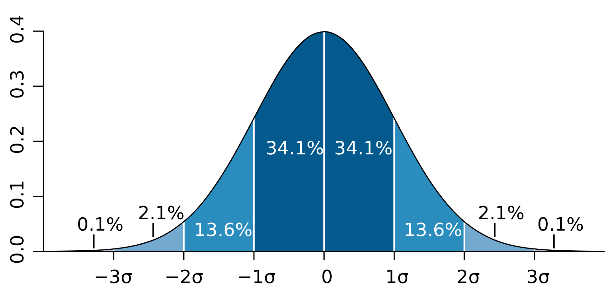

# CHƯƠNG 3: TỔ CHỨC, TRỰC QUAN HÓA VÀ MÔ TẢ DỮ LIỆU (PHẦN 2)

---

**1.1 Mô tả dữ liệu** 

- Số đo xu hướng trung tâm
- Số đo độ phân tán
- Hình dạng của phân phối xác suất

>**Chú ý**: Trong hầu hết các trường hợp, dữ liệu được thu thập dưới dạng mẫu vì không thể thu thập toàn bộ dữ liệu của tổng thể → Các công thức ở dưới được trình bày là công thức dùng cho mẫu (sample)

---

**1.2 Số đo xu hướng trung tâm**

**Trung bình cộng giản đơn (Arithmetic mean)**

Công thức 

$$
\bar{X} = \frac{ \sum_{i=1}^{n} X_i }{n}
$$

- n: số lượng quan sát trong mẫu

**Hai biến thể của trung bình cộng giản đơn là** 

**Giá trị trung bình được cắt bớt (Trimmed mean):** 

>Là giá trị trung bình cộng giản đơn sau khi bỏ đi một tỷ lệ phần trăm nhất định các giá trị bé nhất và lớn nhất ra khỏi dữ liệu 

**Giá trị trung bình thắng (Winsorized mean)**

>Là trung bình cộng giản đơn được tính sau khi một tỷ lệ phần trăm nhất định các giá trị nhỏ nhất và lớn nhất trong tập dữ liệu được thay thế bằng các giá trị gần nhất còn lại trong phân phối

---

**1.2 Số đo xu hướng trung tâm**

**Trung bình có trọng số (Weighted mean)**

Công thức 

$$
\bar{X}_w = \sum_{i=1}^{n} w_i X_i
$$

- $\bar{X}_w$ : giá trị trung bình có trọng số
- $w_i$: trọng số gán cho giá trị quan sát $X_i$
- n: số lượng phần tử trong mẫu

>**Chú ý**: Arithmetic mean là một trường hợp của Weighted mean với $w_i$ bằng nhau 

**Trung bình nhân (Geometric mean)**

Công thức 

$$
\bar{X}_G = \sqrt[n]{X_1 X_2 X_3 \ldots X_n}
$$

- $X_i$: Quan sát thứ $i$
- $X_i$>0 cho $i$=1,2,…,n

>**Chú ý:** Trung bình nhân (trung bình hình học) thường được sử dụng để tính lãi suất trung bình trong một khoảng thời gian, vì nó phản ánh chính xác đặc tính lãi kép của lãi suất

---

**1.2 Số đo xu hướng trung tâm**

**Trung bình điều hòa (Harmonic mean)**

Công thức

$$
\bar{X}_H = \frac{n}{\sum_{i=1}^{n} \left( \frac{1}{X_i} \right)}
$$

- $X_i$: Quan sát thứ $i$
- $X_i$>0 cho $i=1,2,...,n$

**Chú ý**

>Trung bình điều hòa hay được dùng với các quan sát là tỉ số hoặc tỷ lệ

>Trung bình điều hòa có thể được xem như một dạng đặc biệt của trung bình có trọng số, trong đó trọng số của mỗi quan sát tỷ lệ nghịch với độ lớn của chính nó → ảnh hưởng của các outliers sẽ bị giảm đi đáng kể

---

**1.2 Số đo xu hướng trung tâm**

**Số trung vị (Median)**

>Là giá trị nằm ở giữa của một tập hợp dữ liệu sau khi đã được sắp xếp theo thứ tự tăng dần hoặc giảm dần

- Đối với mẫu có số lượng quan sát lẻ $n$, trung vị là giá trị của phần tử nằm ở vị trí $\frac{n + 1}{2}$
- Đối với mẫu có số lượng quan sát chẵn, trung vị được xác định bằng **trung bình cộng của hai giá trị** nằm ở vị trí thứ $\frac{n}{2}$và $\frac{n + 2}{2}$

**Số yếu vị (Mode)**

>Là giá trị xuất hiện thường xuyên nhất trong một tập hợp dữ liệu

>Đây là chỉ tiêu duy nhất dùng được với dữ liệu danh nghĩa

**Phân vị (Quantiles)**

>Là một khái niệm thống kê dùng để chỉ một giá trị mà tại đó một tỷ lệ xác định của dữ liệu nằm ở bên dưới hoặc bằng giá trị đó 

>**VD:** Quan sát x là số phân vị thứ 75 (75th percentile) có nghĩa là có 75% giá trị quan sát trong mẫu nhỏ hơn hoặc bằng x

---

**1.3 Số đo độ phân tán**

**Khoảng biến thiên** 

>Khoảng biến thiên = Giá trị lớn nhất – Giá trị nhỏ nhất

* Điểm mạnh: Dễ dàng để tính 
* Điểm yếu: Không cho biết hình dạng của phân phối 

---

**1.3 Số đo xu hướng trung tâm**

**Độ lệch tuyệt đối trung bình (MAD)**

Công thức

$$
\text{MAD} = \frac{1}{n} \sum_{i=1}^{n} \left| X_i - \bar{X} \right|
$$

- MAD: độ lệch tuyệt đối trung bình cho mẫu
- $X_i$: là giá trị quan sát thứ i
- $\bar{X}$: là giá trị trung bình mẫu (sample mean)
- n: là số lượng quan sát (sample size)

>Điểm mạnh: dễ hình dung, tính toán, dễ hiểu và bao quát được toàn bộ dữ liệu

>Điểm yếu: MAD khó xử lý về mặt toán học hơn so với phương sai (phần sau)

---

**1.3 Số đo xu hướng trung tâm**

**Phương sai (Variance)**

Công thức 

$$
s^2 = \frac{ \sum_{i=1}^{n} \left( X_i - \bar{X} \right)^2 }{ n - 1 }
$$

- $s^2$: Phương sai mẫu
- $X_i$: Giá trị quan sát thứ i
- $\bar{X}$: Trung bình mẫu
- n: Kích thước mẫu
- n−1: Điều chỉnh để có phương sai không thiên lệch (unbiased estimate)

>Điểm mạnh: bao quát được toàn bộ dữ liệu, hay được dùng để xỷ lý toán học trong thống kê suy diễn, hồi quy,…

>Điểm yếu: khó để hình dung ban đầu 

---

**1.3 Số đo xu hướng trung tâm**

**Độ lệch chuẩn (Standard deviation)**

Công thức

$$
\text{std} = \sqrt{s^2} 
$$

- std: Độ lệch chuẩn của mẫu
- $s^2$: Phương sai mẫu

>Điểm mạnh: dễ hiểu hơn vì trả lại đơn vị gốc của dữ liệu, trong khi phương sai sử dụng đơn vị bình phương

>Điểm yếu: chưa dùng để so sánh được cho các tập dữ liệu có quy mô khác nhau 

---

**1.3 Số đo xu hướng trung tâm**

**Hệ số biến thiên (Coefficient of Variation)** 

Công thức

$$
CV = \frac{std}{\bar{X}}
$$

- CV: Hệ số biến thiên
- std: Độ lệch chuẩn của mẫu
- $\bar{X}$: Trung bình mẫu

> Do chỉ tiêu là độ phân tán tương đối nên so sánh được các tập dữ liệu có quy mô khác nhau

---

**1.4 Hình dạng của phân phối xác suất**

**Phân phối chuẩn**

>Là một trong những phân phối quan trọng nhất trong thống kê, được minh họa bằng hình chuông đối xứng (bell-shaped)

Phân phối chuẩn có các đặc điểm sau:

- Trung bình, trung vị và yếu vị đều bằng nhau
- Phân phối được xác định hoàn toàn chỉ bởi hai tham số: trung bình và phương sai (hoặc độ lệch chuẩn)
- Chỉ cần thông tin về trung bình và độ lệch chuẩn là đủ để biết hình dạng của phân phối xác suất

Hình: Phân phối chuẩn

Nguồn: Analytics Vidhya

---

**1.4 Hình dạng của phân phối xác suất**

>Trong trường hợp phân phối không chuẩn, cần sử dụng thêm hai chỉ tiêu nữa để biết được hình dạng của phân phối 

**Độ lệch (skewness)**

Công thức

$$
\text{Skewness} \approx \left( \frac{1}{n} \right) \frac{ \sum_{i=1}^{n} (X_i - \bar{X})^3 }{ s^3 }
$$

- $X_i$: giá trị quan sát thứ $i$
- $\bar{X}$: trung bình mẫu
- $s$: độ lệch chuẩn mẫu
- $n$: số lượng quan sát trong mẫu
- $s^3$: lập phương của độ lệch chuẩn, dùng để chuẩn hóa đơn vị

 > Phân phối chuẩn có độ lệch bằng 0, phân phối lệch dương có độ lệch lớn hơn 0, phân phối lệch âm có độ lệch bé hơn 0

Hình: Phân phối lệch dương và phân phối lệch âm

Nguồn: wikipedia

---

**1.4 Hình dạng của phân phối xác suất**

**Độ nhọn hiệu chỉnh( excess kurtosis)**

Công thức

$$
K_E \approx \left[ \left( \frac{1}{n} \right) \frac{ \sum_{i=1}^{n} (X_i - \bar{X})^4 }{ s^4 } \right] - 3
$$

- $K_E$: độ nhọn hiệu chỉnh
- $X_i$: giá trị quan sát thứ $i$ trong tập dữ liệu
- $\bar{X}$: trung bình mẫu
- $s$: độ lệch chuẩn mẫu
- n: số lượng quan sát
- $s^4$: lũy thừa bậc bốn của độ lệch chuẩn
- 3: giá trị Kurtosis của phân phối chuẩn

> Phân phối có excess kurtosis lớn hơn 0 có phần đuôi dày hơn phân phối chuẩn 

> Phân phối có excess kurtosis bé hơn 0 có phần đuôi mỏng hơn phân phối chuẩn 

---

**1.4 Hình dạng của phân phối xác suất**

**Độ nhọn hiệu chỉnh( excess kurtosis)**

Hình: Biểu đồ minh họa ba kiểu phân phối: Leptokurtic, Mesokurtic và Platykurtic

Nguồn: 365 Data Science

- **Leptokurtic**: phân phối nhọn hơn bình thường (đuôi dài)
- **Mesokurtic**: phân phối chuẩn (normal distribution)
- **Platykurtic**: phân phối bẹt hơn, đuôi ngắn hơn

---

**1.5 Ví dụ** 

  

Hình: Phân phối lợi tức của TCB trong vòng 1 năm gần nhất 

Nguồn: SSI

  

  

    

Bảng: Thống kê mô tả phân phối lợi tức của TCB 

| Chỉ tiêu | Giá trị |
| --- | --- |
| Trung bình (Mean) | 0.15% |
| Trung vị (Median) | 0% |
| Yếu vị (Mode) | 0% |
| Độ lệch chuẩn (std) | 1.64% |
| Hệ số biến thiên (CV) | 10.64 |
| Độ lệch (skewness) | 0.11 |
| Độ nhọn hiệu chỉnh (excessive kurtosis) | 4.91 |

Nguồn: Tác giả tự tính toán 

  

>Trung bình lợi tức hàng ngày của tcb là 0.15%

> Độ lệch chuẩn là 1.64%

> Hệ số biến thiên là 10.64 

> Phân phối lệch phải ít (skewness= 0.11)

> Phân phối nhọn, đuôi dài (excessive kurtosis= 4.91)

