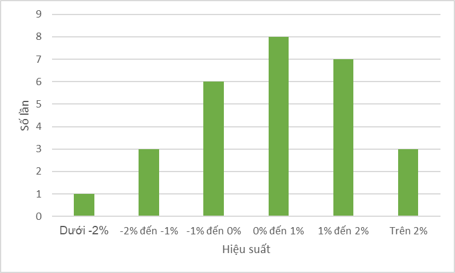

# CHƯƠNG 3: TỔ CHỨC, TRỰC QUAN HÓA VÀ MÔ TẢ DỮ LIỆU (PHẦN 1)

---

**1.1 Giới thiệu** 

>Dữ liệu luôn đóng vai trò then chốt trong phân tích đầu tư và quản lý danh mục. Tuy nhiên, để dữ liệu thực sự hữu ích, việc tổ chức, làm sạch và phân tích chính xác là điều bắt buộc

>Đa phần thời gian của một nhà phân tích nằm ở khâu tổ chức, làm sạch và mô tả dữ liệu, chỉ một phần nhỏ thời gian còn lại dành cho việc phân tích và xây dựng mô hình 

---

**1.2 Loại dữ liệu** 

**Dữ liệu định tính** 

- Dữ liệu danh nghĩa (nominal data)
- Dữ liệu thứ tự (ordinal data)

**Dữ liệu định lượng** 

- Dữ liệu liên tục (continuous data)
- Dữ liệu rời rạc (discrete data)

**Các cách phân loại khác** 

- Dữ liệu có cấu trúc (structured data) vs Dữ liệu phi cấu trúc (unstructured data)
- Dữ liệu chéo (cross-sectional data) vs Dữ liệu chuỗi thời gian (time-series data) vs Dữ liệu bảng (panel data)

---

**1.3 Tổ chức dữ liệu** 

**Mảng một chiều (one-dimensional array)**

- Dùng để tổ chức một biến

**VD** 

Bảng: Dữ liệu giá cổ phiếu TCB

| NGÀY | GIÁ ĐÓNG CỬA |
| --- | --- |
| 23/06/2025 | 33600 |
| 20/06/2025 | 34000 |
| 19/06/2025 | 34000 |
| 18/06/2025 | 32800 |
| 17/06/2025 | 32400 |
| 16/06/2025 | 32300 |
| 13/06/2025 | 31200 |

Nguồn: SSI

---

**1.3 Tổ chức dữ liệu** 

**Mảng hai chiều (two-dimensional array)**

- Dùng để tổ chức nhiều biến

**VD**

 Bảng: Cấu trúc nguồn vốn của ACB 

| CHỈ TIÊU (TỶ VND) | 2023 | 2024 |
| --- | --- | --- |
| NỢ PHẢI TRẢ | 46,000.43 | 46,680.65 |
| VỐN CHỦ SỞ HỮU | 23,240.89 | 26,826.65 |
| TỔNG CỘNG NGUỒN VỐN | 69,241.33 | 73,507.30 |

Nguồn: SSI

---

**1.4 Bảng phân bố tần số & tần suất** 

> Bảng phân phối tần suất & tần số là một bảng dữ liệu được xây dựng bằng cách đếm số lần xuất hiện của một biến theo các giá trị riêng biệt hoặc nhóm, hoặc bằng cách phân loại các giá trị của biến số học vào các khoảng giá trị được sắp xếp theo thứ tự số học 

**VD**

Bảng: Phân bố tần số & tần suất của ACB trong 1 tháng 

| Khoảng lợi suất (%) | Tần số (số ngày) | Tần suất (%) |
| --- | --- | --- |
| Dưới -2% | 1 | 3.6 |
| -2% đến -1% | 3 | 10.7 |
| -1% đến 0% | 6 | 21.4 |
| 0% đến 1% | 8 | 28.6 |
| 1% đến 2% | 7 | 25.0 |
| Trên 2% | 3 | 10.7 |
| Tổng cộng | 28 ngày | 100% |

Nguồn: SSI

---

**1.5 Trực quan hóa dữ liệu**

**Biểu đồ tần suất (histograms)**

>Là một loại biểu đồ thể hiện sự phân bố của dữ liệu số bằng cách sử dụng chiều cao của các cột để biểu thị **tần suất tuyệt đối** của từng khoảng (bin) hoặc khoảng giá trị trong phân bố đó (sử dụng cho dữ liệu định lượng)

**VD**

Hình: Biểu đồ tần suất phân bố lợi suất cổ phiếu ACB

Nguồn: Tác giả sử dụng dữ liệu từ SSI để vẽ biểu đồ

---

**1.5 Trực quan hóa dữ liệu**

**Biểu đồ cột (bar charts)**

>Tương tự như biểu đồ tần suất, nhưng được sử dụng cho dữ liệu định tính 

**VD**

Hình: Số lượng cổ phiếu theo nghành trên sàn chứng khoán HOSE

Nguồn: TradingView

---

**1.5 Trực quan hóa dữ liệu**

**Biểu đồ cây (tree-maps)**

> Biểu đồ này bao gồm nhiều hình chữ nhật màu sắc khác nhau, mỗi hình đại diện cho một nhóm riêng biệt. Diện tích của từng hình chữ nhật tỷ lệ thuận với giá trị của nhóm tương ứng

**VD**

Hình: Biểu đồ thể hiện tăng giảm của cổ phiếu trong ngày

Nguồn: SSI

---

**1.5 Trực quan hóa dữ liệu**

**Wordcloud**

>Đây là dạng biểu đồ để biểu diễn loại dữ liệu phi cấu trúc cụ thể là văn bản. Trong biểu đồ này, các từ được trích xuất từ một nguồn văn bản, và kích thước của từng từ phản ánh tần suất xuất hiện của nó trong nội dung đó — từ càng lớn thì xuất hiện càng nhiều

**VD**

Hình: Wordcloud tin tích cực được tổng hợp từ các trang báo tài chính - kinh tế

Nguồn: PSI

---

**1.5 Trực quan hóa dữ liệu**

**Biểu đồ đường (line-charts)**

>Biểu đồ đường là một dạng đồ thị dùng để trực quan hóa các quan sát theo thứ tự 

>Thường được sử dụng để thể hiện sự thay đổi của một chuỗi dữ liệu theo thời gian

**VD**

Hình: Giá chứng chỉ quỹ VEOF (VinaCapital) 6 tháng gần nhất

Nguồn: fmarket

---

**1.5 Trực quan hóa dữ liệu**

**Biểu đồ phân tán (scatter plot)**

>**Biểu đồ phân tán** là dạng đồ thị dùng để trực quan hóa mối quan hệ giữa hai biến số. Trục hoành và trục tung lần lượt biểu diễn từng biến, và các điểm chấm thể hiện giá trị tương ứng của hai biến tại mỗi quan sát 

>Đây là công cụ hữu ích giúp nhận diện và phân tích các mối quan hệ tiềm ẩn giữa các biến

**VD**

Hình: Tổng tài sản của các ngân hàng trên sàn chứng khoán

Nguồn: Cafef

