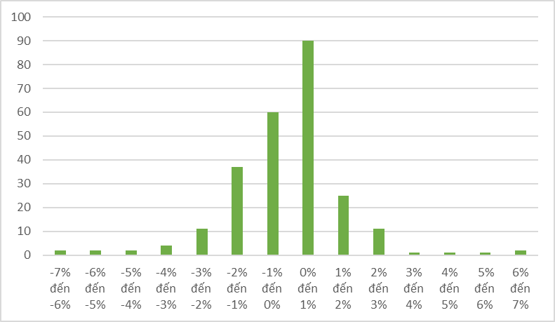

# CHƯƠNG 4: XÁC SUẤT

---

**1.1 Giới thiệu** 

>Xác suất là một đại lượng thể hiện mức độ xảy ra của một biến cố, tức là khả năng xảy ra một sự kiện nào đó (có thể là thường xuyên hoặc ít khi)

>**P(A)**: Xác suất xảy ra biến cố A (0 ≤ **P(A)** ≤ 1)

>**Mutually exclusive events (biến cố xung khắc)**: mô tả hai hoặc nhiều biến cố không thể xảy ra đồng thời

>**Independent events (biến cố độc lập)**: 2 biến cố được gọi là biến cố độc lập nếu việc xảy ra hay không xảy ra của biến cố này không phụ thuộc vào xác suất xảy ra của biến cố còn lại

---

**1.2 Phân loại** 

>Xác suất của một biến cố cụ thể có thể được xác định từ phân phối xác suất của biến ngẫu nhiên tương ứng

**VD** 

Hình: Phân phối xác suất lợi nhuận của TCB một ngày tới dựa trên xác suất thực nghiệm 

Nguồn: SSI

Phân phối xác suất được xác định dựa trên các phương thức sau:

> Dữ liệu lịch sử (Xác suất thực nghiệm) - Hay được sử dụng trong tài chính
> Phân chia đều xác suất (Xác suất cổ điển)
> Đánh giá chủ quan (Xác suất chủ quan)

---

**1.2 Phân loại** 

**Xác suất đồng thời** 

>Xác suất đồng thời của A và B là tổng xác suất của những kết quả mà chúng có chung

$$
P(A \cap B)
$$

**Xác suất có điều kiện** 

>Xác suất có điều kiện của biến cố A, khi biết biến cố B đã xảy ra, được tính bằng xác suất đồng thời của A và B, chia cho xác suất của B (với giả định xác suất của B khác 0

$$
P(A \cap B) = P(A|B) \cdot P(B)
$$

---

**1.3 Công thức**

**Quy tắc cộng xác suất** 

>Chung 

$$
P(A \cup B) = P(A) + P(B) - P(A \cap B)
$$

>Biến cố xung khắc

$$
P(A \cup B) = P(A) + P(B)
$$

**Quy tắc nhân xác suất** 

>Chung 

$$
P(A \cap B) = P(A) \cdot P(B|A) = P(B) \cdot P(A|B)
$$

>Biến cố độc lập 

$$
P(A \cap B) = P(A) \cdot P(B)
$$

---

**1.3 Công thức**

**Trung bình cho một biến ngẫu nhiên** 

$$
E(X) = \sum_{i=1}^{n} x_i \cdot P(x_i)
$$

$x_i$ : Giá trị của biến cố

$P(x_i)$ : Xác suất của biến cố 

$E(X)$ : Trung bình của biến ngẫu nhiên X

**Phương sai cho một biến ngẫu nhiên** 

$$
Var(X) = \sigma^2 = E[(X - \mu)^2] = \sum_{i=1}^{n} (x_i - \mu)^2 \cdot P(x_i)
$$

 $x_i$ : Giá trị của biến cố

$P(x_i)$ : Xác suất của biến cố 

$\mu$ : Trung bình của biến ngẫu nhiên 

$\sigma^2$ : Phương sai 

$\sigma$ : Độ lệch chuẩn 

---

**1.3 Công thức**

**Ví dụ**

Bảng lợi tức của HPG theo 3 kịch bản khác nhau 

|  | Kịch bản tệ (30%) | Kịch bản trung tính (40%) | Kịch bản tốt (30%) |
| --- | --- | --- | --- |
| HPG | -5% | 2% | 5% |

>Trung bình lợi tức của HPG = 30% * -5% + 40% * 2% + 30% * 5% = 0.8%

>Phương sai lợi tức của HPG = 0.0016

>Độ lệch chuẩn lợi tức của HPG = 3.99% (sử dụng bởi vì có cùng đơn vị với lợi tức)

---

**1.4 Danh mục đầu tư: Lợi suất và rủi ro**

**Hệ số tương quan (Correlation coefficient)** 

>Miêu tả mối quan hệ tuyến tính giữa hai biến, giá trị của $r_{xy}$ nằm trong khoảng [-1,1]

$$
r_{xy} = \frac{\sum (X_i - \bar{X})(Y_i - \bar{Y})}{\sqrt{\sum (X_i - \bar{X})^2 \sum (Y_i - \bar{Y})^2}}
$$

$X_i, Y_i$ là các giá trị của hai biến X và Y tại thời điểm i

$\bar{X},\bar{Y}$ là giá trị trung bình của X và Y

$r_{xy}$ là hệ số tương quan giữa hai biến X và Y

---

**1.4 Danh mục đầu tư: Lợi suất và rủi ro** 

**Trung bình cho một danh mục** 

$$
E(X) = w_1E(X_1) + w_2E(X_2) + ... + w_3E(X_n)
$$

$E(X_i)$ : Trung bình lợi tức của tài sản i

$E(X)$ : Trung bình lợi tức của danh mục 

$w_i$ : tỷ trọng của tài sản i trong danh mục 

**Độ lệch chuẩn cho một danh mục** 

$$
\sigma_p = \sqrt{\sum w_i^2 \cdot \sigma_i^2 + 2 \sum w_i w_j \cdot \text{Correlation}(R_i, R_j) \cdot \sigma_i \cdot \sigma_j}
$$

$\sigma_p$ là độ lệch chuẩn (risk) của danh mục đầu tư

$w_i$ là trọng số của tài sản i trong danh mục

$\sigma_i$ là độ lệch chuẩn của tài sản i

Correlation($R_i,R_j$) ****là hệ số tương quan giữa các tài sản i và tài sản j 

---

**1.4 Danh mục đầu tư: Lợi suất và rủi ro** 

**Ví dụ** 

Bảng lợi tức của HPG và MSN theo 3 kịch bản khác nhau 

|  | Kịch bản 1 (30%) | Kịch bản 2 (40%) | Kịch bản 3 (30%) |        Tỷ trọng  |
| --- | --- | --- | --- | --- |
| HPG | -0.05 | 0.02 | 0.05 |            60% |
| MSN | -0.05 | 0 | 0.01 |            40% |

>Tý suất trung bình của cổ phiếu HPG = -0.05*0.3 + 0.02*0.4 + 0.05*0.3 = 0.8%

>Tý suất trung bình của cổ phiếu MSN = -0.05*0.3 + 0*0.4 + 0.01*0.3 = -1.2%

>Trung bình lợi tức của danh mục = 0.008*0.6 + -0.012*0.4 = 0 

>Độ lệch chuẩn của danh mục = 3.39%

