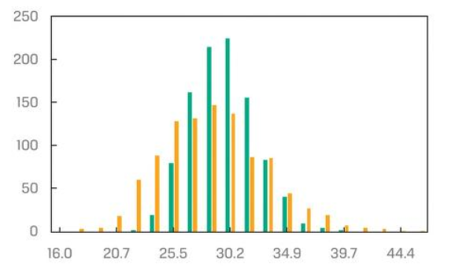

# CHƯƠNG 5: MÔ PHỎNG MONTE CARLO

---

**1.1 Giới thiệu**

>Trong lĩnh vực tài chính, **phương pháp Monte Carlo** là một kỹ thuật mô phỏng mạnh mẽ sử dụng **các mẫu ngẫu nhiên lặp đi lặp lại** để dự đoán các kết quả có thể xảy ra và phân tích rủi ro

>Ứng dụng quan trọng của mô phỏng Monte Carlo trong lĩnh vực đầu tư là một công cụ để **định giá các chứng khoán phức tạp mà không có công thức định giá phân tích nào khả dụng**

---

**1.2 Giả định**

>**Khả năng tạo số ngẫu nhiên:** Phải có khả năng tạo ra một lượng lớn các số ngẫu nhiên (giả ngẫu nhiên) chất lượng cao theo phân phối đồng nhất

>**Mô hình xác suất rõ ràng:** Cần có một mô hình toán học hoặc thống kê xác định rõ các biến đầu vào, phân phối xác suất và mối quan hệ giữa chúng.

>**Các lần mô phỏng độc lập:** Mỗi kịch bản mô phỏng phải độc lập với nhau để đảm bảo kết quả hội tụ

>**Số lượng mô phỏng đủ lớn:** Cần chạy đủ nhiều lần mô phỏng để kết quả đại diện và đáng tin cậy

>**Khả năng tính toán cho mỗi kịch bản:** Mô hình phải có khả năng thực hiện các phép tính cho từng bộ giá trị ngẫu nhiên được tạo ra

---

**1.3 Quy trình thực hiện**

**Chỉ ra các tham số trong mô phỏng** 

>**Bước 1**: Xác định đại lượng cần quan tâm (ví dụ: giá trị của yêu cầu thanh toán phụ thuộc)

>**Bước 2**: Xác định lưới thời gian, chia thành K khoảng con với độ dài bước thời gian Δt cho toàn bộ phạm vi thời gian

>**Bước 3**: Đưa ra các giả định phân phối cho các yếu tố rủi ro chính

**Chạy mô phỏng** 

>**Bước 4**: Sinh các số ngẫu nhiên chuẩn (standard normal random numbers) cho từng yếu tố rủi ro chính qua mỗi khoảng con

>**Bước 5**: Chuyển đổi các số ngẫu nhiên chuẩn thành giá cổ phiếu, giá cổ phiếu trung bình, và các yếu tố rủi ro liên quan khác

>**Bước 6**: Tính toán giá trị và giá trị hiện tại của khoản thanh toán phụ thuộc

>**Bước 7**: Lặp lại các bước 4-6 trong số lần mô phỏng được chỉ định. Sau đó, tính toán giá trị tổng hợp (ví dụ: giá trị trung bình của giá trị hiện tại của khoản thanh toán phụ thuộc)

---

**1.4 Ví dụ** 

>Một chứng khoán cam kết tùy chọn có giá trị tại thời điểm đáo hạn bằng chênh lệch giữa giá cổ phiếu cơ sở tại thời điểm đáo hạn và giá trị trung bình của cổ phiếu trong suốt thời gian giao dịch của chứng khoán cam kết tùy chọn hoặc $0, giá trị nào lớn hơn. 

>Ví dụ, nếu giá cổ phiếu cơ sở cuối kỳ là $34 và giá trị trung bình trong suốt thời gian sống của chứng khoán là $31, giá trị của chứng khoán cam kết tùy chọn tại thời điểm đáo hạn là $3 (lớn hơn giữa $34 - $31 = $3 và $0) (CFA curriculum)

##### → Rất khó để định giá được chính xác chứng khoán có cấu trúc phức tạp như này

##### → Monte Carlo là giải pháp tối ưu cho trường hợp này 

---

**1.4 Ví dụ**

**Xây dựng Mô phỏng Monte Carlo cho ví dụ** 

1. **Xác định đại lượng quan tâm theo các biến cơ sở:**
 Đại lượng quan tâm trong ví dụ này là giá trị của chứng khoán yêu cầu phụ thuộc, và biến cơ sở là giá cổ phiếu. Sau đó, xác định giá trị ban đầu của các biến cơ sở

2. **Xác định lưới thời gian:**
 Chia thời gian theo đơn vị thời gian lịch và chia nó thành một số kỳ con - ví dụ, K kỳ con. Thời gian chia cho số kỳ con, K, sẽ là bước thời gian, At. Trong ví dụ này, thời gian là một năm và K là 12, vì vậy At bằng một tháng

3. **Xác định giả định phân phối cho các yếu tố rủi ro chính:** 
Ví dụ, giá cổ phiếu là biến cơ sở cho chứng khoán yêu cầu phụ thuộc, vì vậy cần một mô hình cho sự thay đổi của giá cổ phiếu. Chúng ta chọn mô hình sau cho sự thay đổi giá cổ phiếu, với Z là biến chuẩn ngẫu nhiên chuẩn:

   $$
    \Delta \text{Giá cổ phiếu} = \left( u \times \text{Giá cổ phiếu trước đó} \times \Delta t \right) + \left( \sigma \times \text{Giá cổ phiếu trước đó} \times Z \right)
    $$
    

---

**1.4 Ví dụ**

**Xây dựng Mô phỏng Monte Carlo cho ví dụ** 

4. **Sử dụng chương trình máy tính hoặc hàm bảng tính:**
 Vẽ K giá trị ngẫu nhiên của mỗi yếu tố rủi ro. Ví dụ, hàm bảng tính sẽ vẽ K (= 12) giá trị của biến chuẩn Z

5. **Chuyển đổi các số ngẫu nhiên chuẩn thành sự thay đổi giá cổ phiếu:** 
Dùng mô hình động thái giá cổ phiếu từ bước 3 để chuyển các số ngẫu nhiên chuẩn thành sự thay đổi giá cổ phiếu. Kết quả là K quan sát về sự thay đổi giá cổ phiếu qua các kỳ con (K = 12)
6. **Tính giá trị của chứng khoán yêu cầu phụ thuộc tại đáo hạn:** 
Sau đó, chiết khấu giá trị này để tính giá trị hiện tại của nó bằng cách sử dụng lãi suất thích hợp
7. **Lặp lại các bước cho số lần thử nghiệm yêu cầu:**
 Lặp lại từ bước 4 cho đến khi hoàn thành số lần thử nghiệm J (ví dụ, J = 1,000). Cuối cùng, tính giá trị trung bình của các giá trị để ước tính giá trị của chứng khoán yêu cầu phụ thuộc

---

**1.4 Ví dụ** 

**Kết quả**

Hình: Biểu đồ tần suất của giá cuối cùng và giá trung bình cổ phiếu

Nguồn: CFA curriculum

* Màu xanh : Giá trung bình

* Màu vàng: Giá cuối cùng

* Trục y: Số lần thử

* Trục x: Giá (USD)

---

**1.4 Ví dụ** 

**Kết quả**

Hình: Biểu đồ tần suất của giá trị chứng khoán cam kết tùy chọn tại thời điểm đáo hạn

Nguồn: CFA curriculum

* Màu xanh : Giá trị của chứng khoán

* Trục y: Số lần thử

* Trục x: Giá (USD)

##### → 65.4% trường hợp giá trị của chứng khoán cam kết tùy chọn bằng 0

##### → 34.6% trường hợp giá trị của chứng khoán cam kết tùy chọn lớn hơn 0 (giá trị lớn nhất = 11$)

