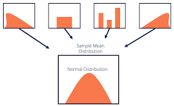

# CHƯƠNG 6: GIỚI THIỆU VỀ ĐỊNH LÝ GIỚI HẠN TRUNG TÂM VÀ PHÂN TÍCH HỒI QUY ĐƠN
---

**1.1 Giới thiệu**

>Trong phần này, Định lý giới hạn trung tâm (CLT) sẽ được giới thiệu qua bởi vì đây là nền tảng để ước lượng các hệ số beta trong hồi quy 

>Phân tích hồi quy là công cụ phổ biến hay được dùng hiện nay trong tài chính cũng như nhiều lĩnh vực khác như học máy, kinh tế lượng

>Mục tiêu chính của phân tích hồi quy là hiểu cách các biến độc lập ảnh hưởng đến biến phụ thuộc, và sử dụng mô hình đã xây dựng để dự đoán giá trị của biến phụ thuộc dựa trên các giá trị của biến độc lập

---

**1.2 Định lý giới hạn trung tâm (CLT)**

Hình: Minh họa định lý giới hạn trung tâm

Nguồn: corporatefinanceinstitute

Với một tổng thể được mô tả bởi bất kỳ phân phối xác suất nào có giá trị trung bình μ và phương sai hữu hạn σ², phân phối lấy mẫu của trung bình mẫu X̅ được tính từ các mẫu ngẫu nhiên kích thước n từ tổng thể này sẽ xấp xỉ phân phối chuẩn với giá trị trung bình μ (giá trị trung bình của quần thể) và phương sai σ²/n (phương sai của tổng thể chia cho n) khi kích thước mẫu n lớn

**Sai số chuẩn (Standard error)**

Là độ lệch chuẩn của phân phối lấy mẫu của trung bình (sampling distribution)

**Công thức** 

Khi biết độ lệch chuẩn của quần thể 
 
$$
\sigma_{\bar{x}} = \frac{\sigma}{\sqrt{n}}
$$

Khi không biết độ lệch chuẩn của quần thể và sử dụng độ lệch chuẩn của mẫu (s) để ước tính

$$
s_{\bar{x}} = \frac{s}{\sqrt{n}}
$$

→ Đa phần các trường hợp sử dụng công thức thứ 2

→ Sai số chuẩn khác với độ lệch chuẩn của phân phối mẫu hay phân phối tổng thể

---

**1.2 Định lý giới hạn trung tâm (CLT)**

**Xây dựng khoảng tin cậy (Confidence interval)**

Một khoảng tin cậy 100(1 — α)% cho một tham số có cấu trúc như sau:

**Ước lượng điểm + Hệ số độ tin cậy x Sai số chuẩn**

Trong đó:

- Ước lượng điểm = một ước lượng điểm của tham số (một giá trị của thống kê mẫu)
- Hệ số độ tin cậy = một số dựa trên phân phối giả định của ước lượng điểm và mức độ tin cậy (1 - α) cho khoảng tin cậy (tra bảng t và bảng z)
- Sai số chuẩn = sai số chuẩn của thống kê mẫu cung cấp ước lượng điểm

Bảng: Quy tắc sử dụng bảng thống kê z-test và t-test

| **Lấy mẫu từ** | **Thống kê cho kích thước mẫu nhỏ** | **Thống kê cho kích thước mẫu lớn** |
| --- | --- | --- |
| **Phân phối chuẩn với phương sai đã biết** | **z** | **z** |
| **Phân phối chuẩn với phương sai chưa biết** | **t** | **t*** |
| **Phân phối không chuẩn với phương sai đã biết** | **Không có sẵn** | **z** |
| **Phân phối không chuẩn với phương sai chưa biết** | **Không có sẵn** | **t*** |

Nguồn: CFA curriculum 

---

**1.2 Định lý giới hạn trung tâm (CLT)**

**Ví dụ**

Thu thập 30 quan sát về lợi nhuận theo tháng của cổ phiếu HPG có trung bình mẫu = 0.5% và đô lệch chuẩn mẫu = 0.15%. Ước lượng khoảng tin cậy 95% cho lợi nhuận trung trình theo tháng của cổ phiếu HPG

$$
μ = 0.005 ± 2.045 × (0.0015 / \sqrt{30})
$$

- **μ**: Khoảng tin cậy 95% lợi nhuận trung bình của cổ phiếu HPG mà ta đang ước lượng
- **0.005**: Trung bình mẫu
- **2.045**: Hệ số độ tin cậy t cho mức độ tin cậy 95%
- **0.0015**: Độ lệch chuẩn mẫu
- $\sqrt{30}$: Căn bậc hai của kích thước mẫu, dùng để tính sai số chuẩn

---

**1.3 Hồi quy đơn**

**Mô hình** 

Mối quan hệ tuyến tính giữa biến phụ thuộc Y và biến độc lập X được mô tả bằng hàm số

$$
Y_i = b_0 + b_1 X_i + e_i, \quad i = 1, \dots, n
$$

Hàm số này cho biết Y bằng tổng của hệ số chặn $b_0$ và hệ số góc  nhân với X, cộng với sai số $e_i$. Sai số đại diện cho sự khác biệt giữa giá trị Y quan sát được và giá trị Y kỳ vọng theo mối quan hệ thực tế giữa Y và X. Các hệ số $b_0$ và $b_1$ được gọi là hệ số hồi quy

**Giả định**  

- **Tính tuyến tính (Linearity)**: Mối quan hệ giữa biến phụ thuộc, Y, và biến độc lập, X, là tuyến tính.
- **Phương sai đồng nhất (Homoscedasticity)**: Phương sai của phần dư hồi quy là giống nhau cho tất cả các quan sát.
- **Độc lập (Independence)**: Các quan sát, cặp giá trị Y và X, là độc lập với nhau. Điều này có nghĩa là phần dư hồi quy không có sự tương quan giữa các quan sát.
- **Phân phối chuẩn (Normality)**: Phần dư hồi quy có phân phối chuẩn.

---

**1.3 Hồi quy đơn**

**Phương pháp ước lượng** 
Để điều chỉnh đường hồi quy, ta cần **tối thiểu hóa tổng bình phương phần dư** (SSE), được tính bằng công thức

$$
SSE = \sum_{i=1}^{n} (Y_i - \hat{Y}_i)^2 = \sum_{i=1}^{n} (Y_i - (b_0 + b_1 X_i))^2
$$

Sử dụng hồi quy bình phương tối thiểu để ước lượng các tham số $b_0$ và $b_1$, từ đó vẽ đường hồi quy giải thích giá trị Y cho bất kỳ giá trị nào của X

**Lưu ý**: Các giả định ở trên giúp cho ước lượng được tốt nhất (BLUE) về mặt toán học, tuy nhiên các giả định không giải thích vì sao OLS là phương pháp phù hợp cũng như ý nghĩa của E(u/x) = 0 trong việc nhìn nhận mối quan hệ tương quan (tham khảo trong sách của Angrist)

---

**1.3 Hồi quy đơn** 

**Công thức ước lượng hệ số** 

Hệ số chặn $b_0$

$$
b_0 = \overline{Y} - b_1 \overline{X}
$$

Hệ số góc $b_1$

$$
b_1 = \frac{Cov(Y, X)}{Var(X)}
$$

---

**1.3 Hồi quy đơn**

**Hai tham số quan trọng để so sánh mô hình** 

$R^2$

$F-statistic$ (quan trọng hơn)

**VD:** Một nhà phân tích đang nghiên cứu mối quan hệ giữa **tăng trưởng hàng năm của chi tiêu tiêu dùng (CONS)** trong một quốc gia và **tăng trưởng hàng năm của Tổng sản phẩm quốc nội (GDP) của quốc gia đó (GGDP)**

Mô hình 1:  $GGDP_t = b_0 + b_1 \cdot CONS_t + \varepsilon_t$

Mô hình 2: $GGDP_t = b_0 + b_1 \cdot \ln(CONS_t) + \varepsilon_t$

| Thông số | Mô hình 1 | Mô hình 2 |
| --- | --- | --- |
| Hệ số chặn (Intercept) | 1.040 | 1.006 |
| Hệ số góc (Slope) | 0.669 | 1.994 |
| R^2 | 0.788 | 0.867 |
| F-thống kê (F-statistic) | 141.558 | 247.040 |

**Mô hình 1** là mô hình hồi quy tuyến tính đơn **không có biến đổi biến**, trong khi **Mô hình 2** là mô hình **lin-log**, trong đó **logarit tự nhiên của biến CONS** được sử dụng làm biến độc lập.

**Mô hình 2 phù hợp với dữ liệu tốt hơn**. Vì biến phụ thuộc giống nhau trong cả hai mô hình, ta có thể so sánh mức độ phù hợp của các mô hình thông qua **các thước đo tương đối** (như R2R^2R2 hoặc thống kê F) hoặc **thước đo tuyệt đối** là **sai số chuẩn của ước lượng**.

Kết quả cho thấy:

- **Sai số chuẩn của ước lượng** ở Mô hình 2 **thấp hơn**,
- Trong khi đó, cả **R2R^2R2** và **thống kê F** đều **cao hơn** ở Mô hình 2 so với Mô hình 1.

=> Điều này cho thấy Mô hình 2 mô tả mối quan hệ giữa các biến một cách tốt hơn.